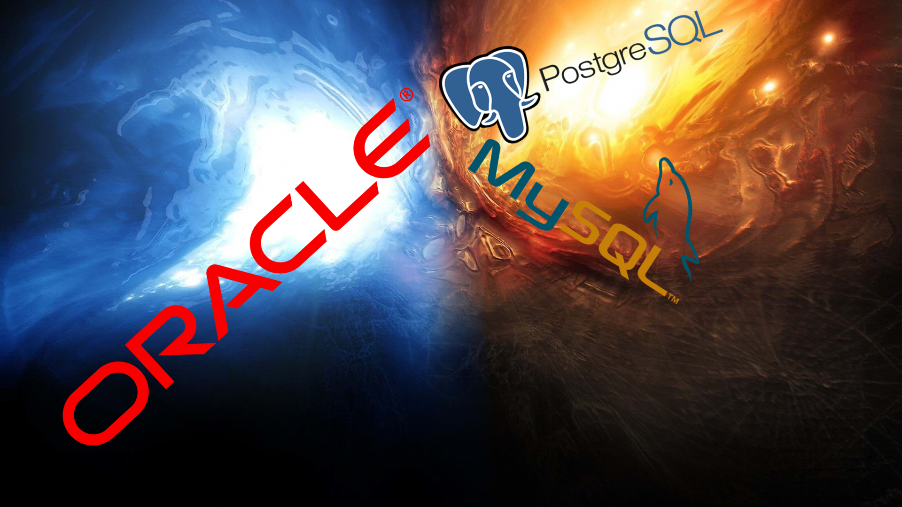

# Oracle, Mysql, Postgres

 
Durante muchos años hemos visto que hay muchos sistemas base de datos relacionales pero sin duda las mas conocidas hasta ahora y quizás esten el liston mas 
alto son Mysql, Postgres y Oracle. Pero claro puede surgir la pregunta ¿Cual monto en mi centro de datos?. Esa es una pregunta que habrá que pensar
y meditar con tiempo para ver lo factible  que nos puede ser cada una y que realmente vamos a necesitar. En este articulo intentaremos ayudarte a 
elegir explicandote un poco las limitaciones que tiene mysql y postgres contra oracle en el tema de almacenamiento. Antes de empezar solo recalcar
que no estamos echándole tierra a Mysql y Postgres, ya que esas base de datos están para lo que estan no significa que no sirvan para nada ;). 

## Claúsulas de almacenamiento 
Bien nos encontramos con la primera limitación que no nos proporciona ni mysql ni postgres pero si nos lo proporciona oracle. Bien pero ¿Ques es esto?
Las clausualas de almacenamiento como bien dice su nombre es un claúsula que podemos añadir tanto al crear tablas como tablespaces en oracle
que nos permite configurar las extenesiones de dicho objeto como por ejemplo: 
-Tamaño inicial de la primera extensión
-Tamañao de las próximas extensiones que se creen
-Extensiones reservadas
-Total de extensiones que puede tener
Las claúsulas de almacenamiento quizás nos puedan servir en un entorno complejo pero si nos vamos a dedicar a crear tablas y poco más quizás no
nos convenga.
 
## Tablespaces temporales 
Sigamos con otra limitación mas, esta vez nos encontramos con una que quizás ya nos deje un mal sabor de boca con mysql y postgres y es que en estos
sistemas de base de datos no nos es posible crear tablespaces temporales. Eso sí tanto mysql como postgres nos permite crear tablas temporales pero
claro no es lo mismo. Los tablespaces temporales pueden ser de mucha utilidad para balancear la carga si tenemos en nuestro sistema de base de datos
muchos usuarios. Pero claro mysql y postgres no estan preparados para tener una base de datos con miles y miles de usuarios.
 
## Mas de un fichero en una tablespace 
Otra limitación, ni postgres ni mysql nos permite añadir mas de un fichero a un talespace. Esto sin duda es una limitación que quizás no pueda limitar
un poco mas si quizás queremos tener nuestro tablespace como en un pequeño cluster de ficheros. 
 
## Opción Max Size Tablespace 
Bueno y esta quizás sea la limitación mas grande que nos pone mysql y postgres y la que de verdad nos dirá que gestor de base de datos usar. Al crear
Tablespaces en oracle podemos indicarle el máximo tamaño que podrá tener el tablespace para que nuestros usuarios no puedán sobrepasar el límite y puedan
crear objetos por doquier. Mysql y postgres en caso de que tuviéramos miles y miles de usuarios cada uno podría crear los objetos que quisiera y podría
poner en peligro el almacenamiento de nuestro servidor.
 
## Conclusión 
En conclusión podemos decir: 
¿En tu esquema vas a tener a muchos usuarios que van entrar en la base de datos y cada uno creará sus objetos?. 
- Escoge Oracle que te permite un mejor gestión del almacenamiento sobre tus usuarios. 
¿En tu esquema a penas vas a tener usuarios, solo crearás algunos objetos y no te importarán mucho como se almacenen?
- Escoge mysql o Postgres, además de ser mas sencillo de administrar esta pensado para base de datos pequeñas.
